# Install postgreSQL in IBM Cloud

PostgreSQL-HA is a powerful, open source object-relational database system that uses and extends the SQL language with High Availability (HA). This documentation will guide you on how to install postgreSQL on the IBM Cloud using the Kubernetes Service. Simple and effective.

## Pre-requisites

You must have an account created in IBM Cloud. The account needs to either be *Pay-As-You-Go* or *Subscription*. Click [here](https://cloud.ibm.com/docs/account?topic=account-accounts "here") to read more.
If you have a Lite account, you can upgrade it. Click [here](https://cloud.ibm.com/docs/account?topic=account-account-getting-started#account-gs-upgrade "here") to learn how to upgrade.

## Step 1: Provision Kubernetes Cluster

* Click on the search section at the top of the main page, type Kubernetes, and then choose Kubernetes Service.

* In the new window, select between the free and standard type under "Pricing plan". Once selected, click on create.

We'll choose the Standard Plan for this documentation as the Free Plan may fall short of resources when deploying your pods. We highly recommend using a Standard Plan with the hardware that suits you the best. If you're selecting the Standard Plan, please make sure you select the adequate requirements,

* Select your Kubernetes Version to be the latest available or the required one by your application. In this example, we have set it to be '1.18.13'.
* Select Infrastructure as 'Classic'.
* Leave Resource Group to 'Default'.
* Select Geography to the one that suits you better or that fits your infrastructure.
* Select Availability to be 'Single Zone' or 'Multi Zone' depending on your needs.
* Select a Worker Zone that suits you better or that fits your infrastructure.

* Select the number of workers in Worker Pool.
* Give your Worker Pool a name.
* Leave the Encrypt Local Disk option 'On'
* Choose 'Both private and public endpoints' on Master Service Endpoint

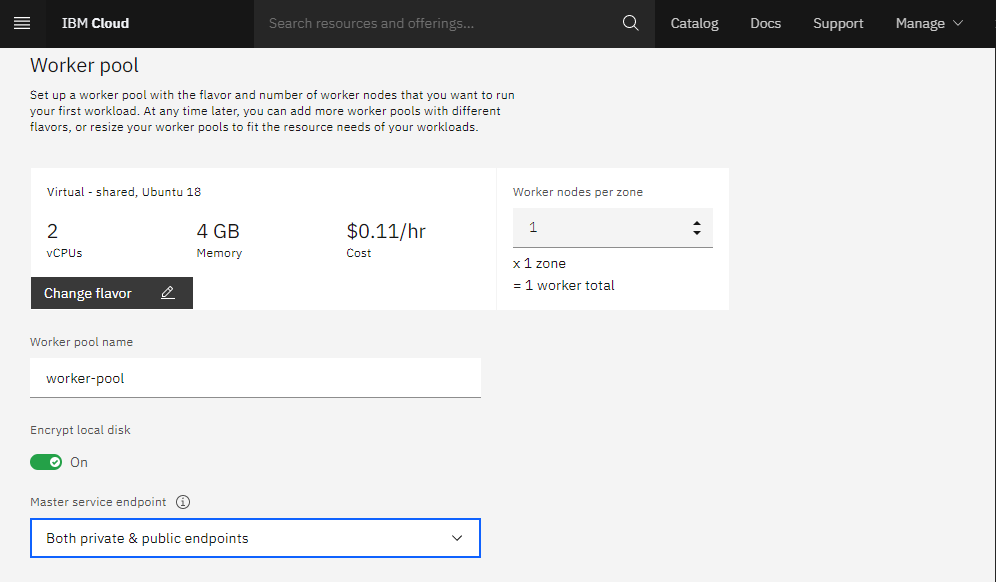

* Give your cluster a name in 'cluster-name'
* Provide the tags to your cluster and click on Create.

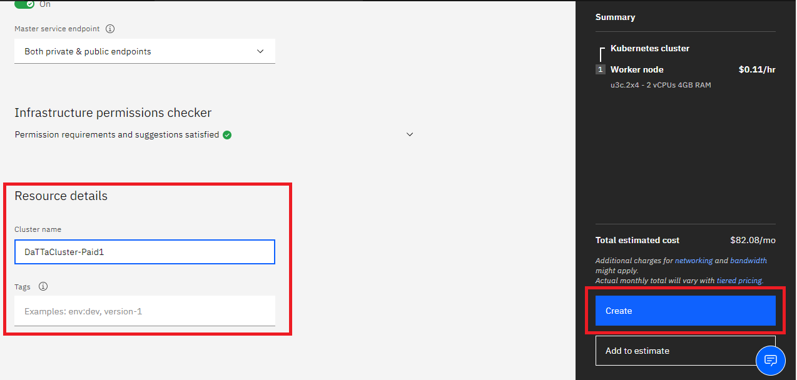

Wait a few minutes while your cluster is deployed.

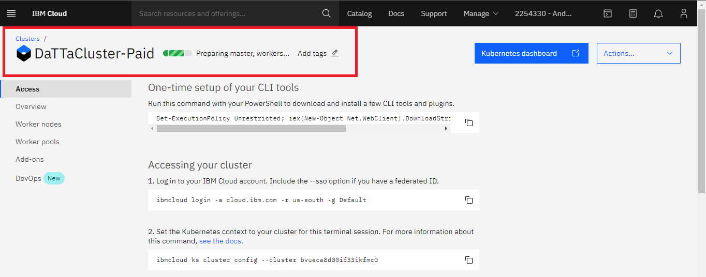

The following checkmark and the word 'normal' will appear once the Kubernetes Cluster is deployed. You can check it under your cluster section which is located in your *Resources List*.

## Step 2:  Deploy IBM Cloud Block Storage plug-in

* Click on the search section at the top of the main page, select IBM Cloud Block Storage, and click on it.

* A new window opens, select the cluster and enter the name you want for this workspace, in this case, it will be called _storage-example_, accept the terms, click *Install* and wait a few minutes.

## Step 3: Install postgreSQL HA

* Click on the search section at the top of the main page, type postgreSQL HA, and click on it.

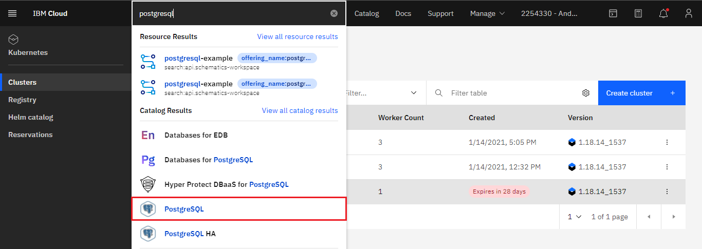

* A new window opens, select the cluster and enter the name you want for the PostgreSQL HA workspace; in this case, it will be called _postgresql-ha-example_; then, go to the bottom to find the workspace parameters.

You can modify the different installation parameters at the bottom. We will leave them by default except for the user password for PostgreSQL and its pool, which you will need to access your PostgreSQL console and work with your databases. You can read more about setting up the parameters, including defining the number of PostgreSQL motors inside the pool [here](https://cloud.ibm.com/catalog/content/postgresql-ha "here").

Make sure you set up a password in the _postgresqlPassword_ and the pgpool.adminPassword variable. 

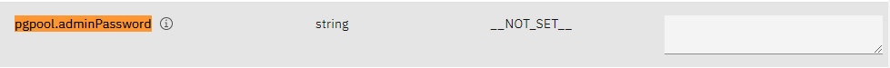

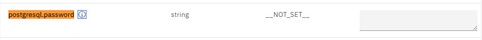

You can create an additional non-admin user if you edit the _postgresql.username_ variable. The admin user will continue to be 'Postgres.' 

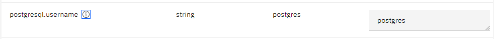

When you're done, accept the terms, and click on *Install*.

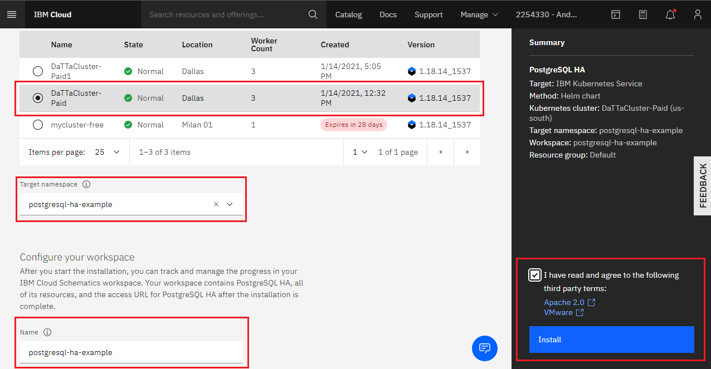

## Step 4: Verify Installation

* Go to *Resources List* in the Left Navigation Menu and click on *Kubernetes*.

* Click the *Actions* button and select *Web terminal*.

* A window opens to install the web terminal, click on install and wait a few minutes. The window will pop up at the buttom If the web terminal is already installed.

* Once you have installed the terminal, open it and type the following command. It will show you the workspaces of your cluster. You can see *postgresql-ha-example* is now active.

`$ kubectl get ns`

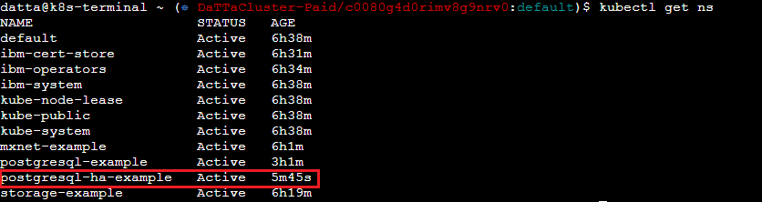

* You can then obtain more data about the service and it's pods.

`$ kubectl get pod -n NAMESERVICE -o wide`

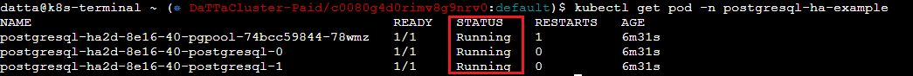

* Find the port of your elected pod, you will need it to start using PostgreSQL. In this case, we will use the PostgreSQL pool pod.

`$ kubectl get service -n NAME SERVICE`

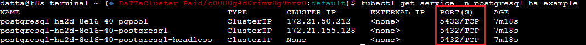

* Select the pod within your service using bash so you can start using PostgreSQL from the terminal.

`$ kubectl exec --stdin --tty PODNAME -n NAMESPACE -- /bin/bash`

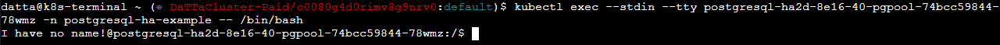

* Once you're inside the pod terminal, you can execute the following command to login into PostgreSQL and create and manage your databases. Use your previously created password. You can do the same with the other PostgreSQL databases systems or pods within the High Availability installation.

`$ psql -h localhost -U postgres --password -p 5432`

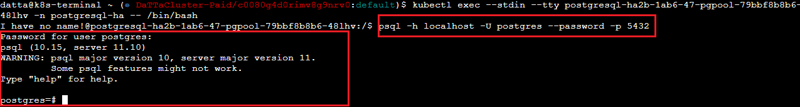

You have finished the installation, enjoy your PostgreSQL HA installation!
